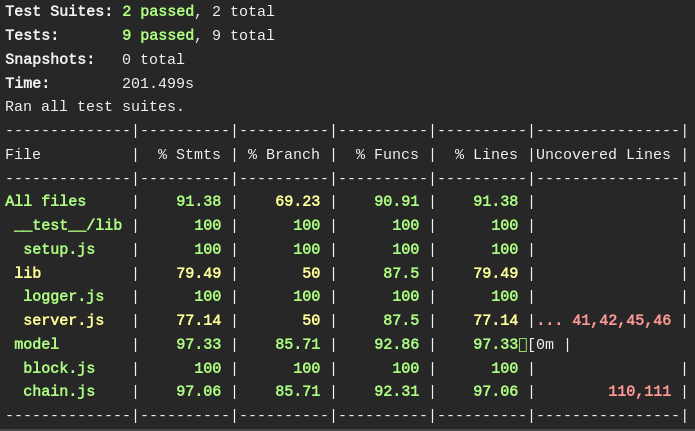

# Noncents

## Problem Domain

This project is our initial attempt to understand and replicate the blockchain technology and potential applications.

Due to the blockchain's immutability, it allows both the sender and receiver to trust that the information sent follows a dictated structure and has a determined result.

We included the ability for distributed nodes to add to the blockchain with a simple terminal command.

## Prerequisites
Install the stable version of Node JS, which is available at the following link
`https://nodejs.org/en/`

This environment should allow you to run all code present in this repository.

## Installing
Create a new directory where you would like to store our project.

ex: 
```
mkdir noncents
```
Clone the repository to this directory

```
git clone https://github.com/HashMoney/Noncents.git

```
Install NPM dependencies
```
npm install 
```
If you would like to begin mining immediately, use the following command

```
node index.js
```


***↑ Before Mining***

***After Mining ↓***


For advanced users, a server side code base is available under the branch herokuStaging at the project's git repository.   

```
https://github.com/HashMoney/Noncents.git
```

## Running the tests
To run the tests, you type into the command line `npm run test`
This will run all tests and output a coverage level (provided by Jest) describing percentage of lines covered across documents.

**Main Server Test Results:**


**Node Server Test Results:**




## Server Endpoints

* `POST /block`
  - Node sends request to Heroku server to post new block to stable chain.
  - Heroku server checks to see if it is the next valid block in the chain.
  - If block is valid, Heroku server returns a 204 success status code to the node.
  - If block is valid, Heroku appends new block to the stable chain.
  - Returns a 400 failure status code to the node if either the index, previous hash, current hash are invalid or if this information is missing.
 
* `GET /chain`
  - Node sends a request to the Heroku server for the current stable chain.
  - Heroku server retrieves stable chain from database and sends stable chain back to node.
  - Heroku server returns a 200 success status code to the node.
  - Returns a 404 failure status code if an incorrect route is specified.

* `/`
  - Catch all route for any unspecified routes.
  - Returns a 404 Not Found

## Built With

- Node - JS Runtime Build  
- Mongo DB - Chain Persistence  
- Heroku - Hosted Deployment   
- Travis CI -  Integration Testing 

## Code Examples

***Block from Chain***
```
{
        "index": 1,
        "previousHash": "000lUu0u82sRhgvltSGzbBJZefYnbv+E6py9dC1/0NU=",
        "timeStamp": "Fri Jan 05 2018 08:54:21 GMT-0800 (PST)",
        "ledger": "necessitatibus aut enim voluptates ut est sed dolor voluptas nulla",
        "currentHash": "0006dXneGWKoICEfxybrwhwwu257M/cmFytTXdye4l0=",
        "nonce": 616877
      },
```

***Hashing Code Example***

```
chainSchema.methods.makeBlockHash = function(index, timeStamp, previousHash, ledger, nonce){
  let SHA256 = new Hashes.SHA256;
  let nextHash = SHA256.b64(index + timeStamp + previousHash + ledger);
  let nonceHash = SHA256.b64(nextHash + nonce);
  return nonceHash;
};
```

## NPM Packages Used 
- Express - CRUD routes to server  
- Jest, Superagent - Unit Testing  
- Mongoose - Data manipulation within Mongo
- JS Hashes - SHA256 Hashing   
- Eslint - Linting  
- HttpErrors, Winston - Activity/Error Logging

## Authors
- Kerry Nordstrom
- Seth Donohue
- Nicholas Carignan
- Jacob Evans

## License
This project is licensed under the MIT License - see the [LICENSE.md](./LICENSE) file for details

**WIKI**: https://github.com/HashMoney/Noncents/wiki

**Travis CI**: https://travis-ci.org/HashMoney/Noncents

**Heroku App** Deployment: https://noncents.herokuapp.com/

**Heroku Chain Get Route**:
http://noncents.herokuapp.com/chain

## Acknowledgments
- We referenced a compact 200-line blockchain called Naivechain, written in JS, in order to define best practices for our code https://github.com/lhartikk/naivechain/blob/master/main.js
